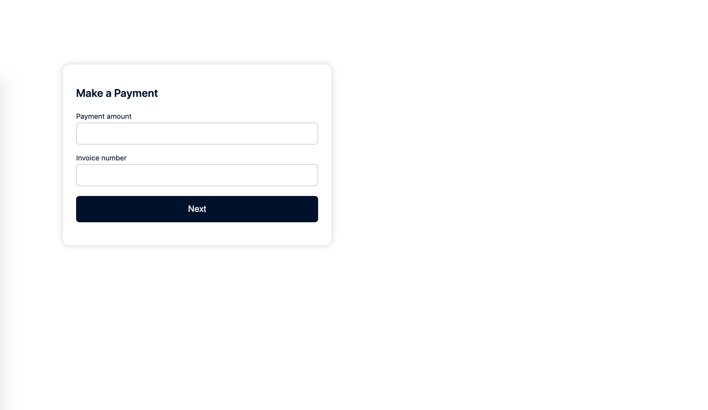

# Adyen Pay by Link Demo

This is a simple demonstration of Adyen's Pay by Link (https://docs.adyen.com/checkout/pay-by-link) API.

To configure this demo, set the `$apikey` and `$merchantAccount` values in the **index.php** file. See https://docs.adyen.com/checkout/get-started for more information.

To run, execute the following command:

    php -S localhost:3000 -t .

Then go to http://localhost:3000/ in your browser.

This demonstration will allow the user to enter an amount, a reference, then click **Next**, upon which point a payment link will be generated and the user will be automatically redirected to the Adyen Pay by Link page.

